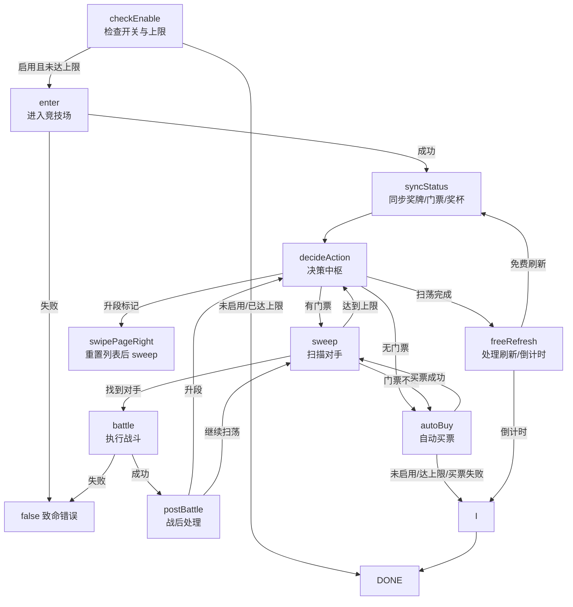
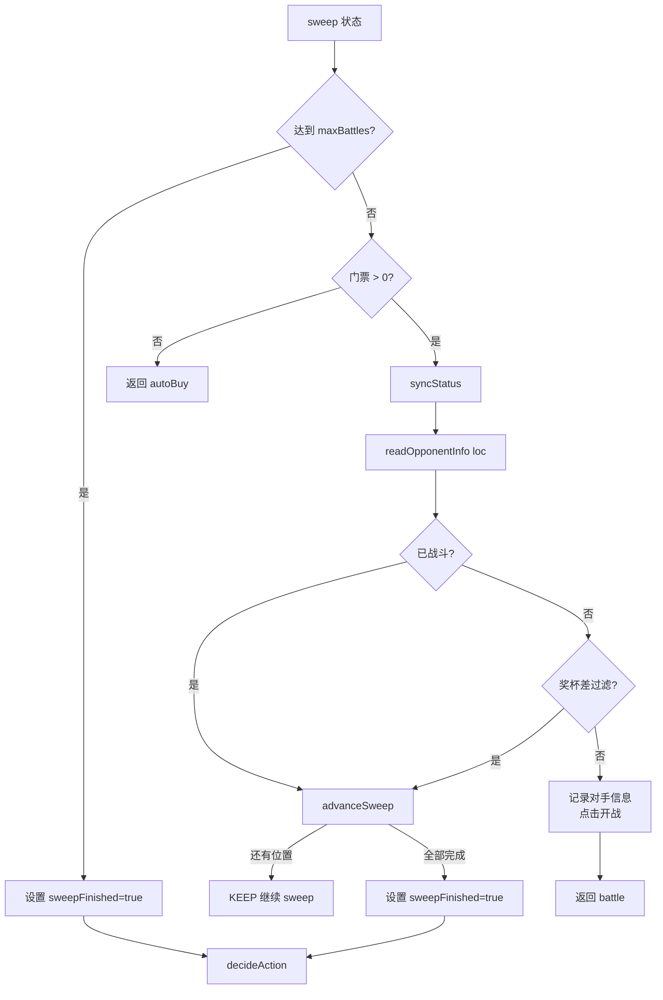
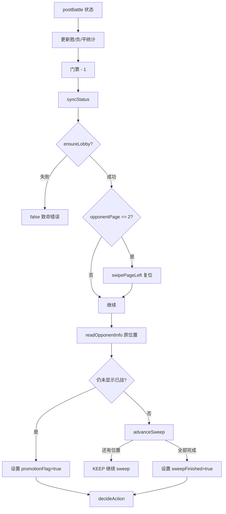
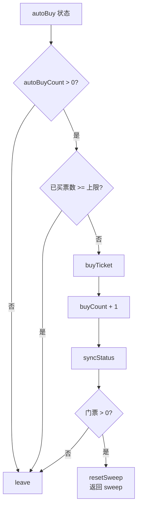
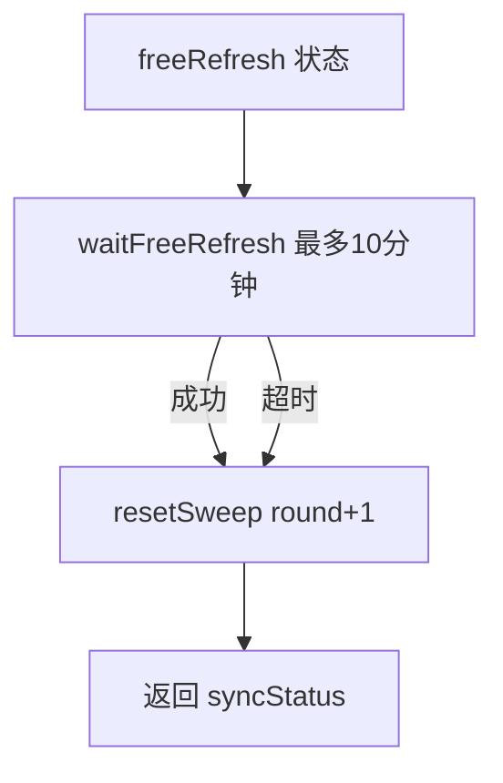
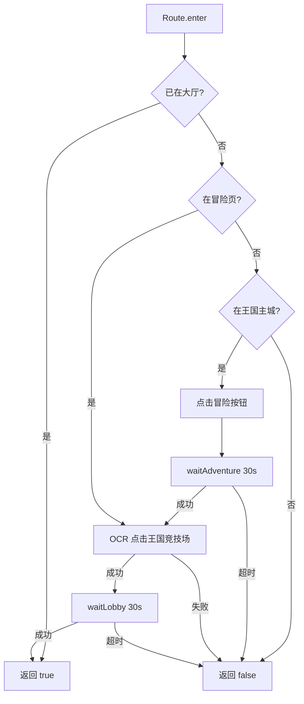
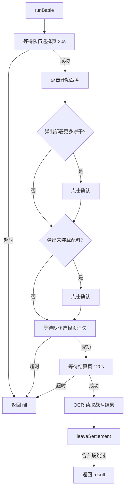
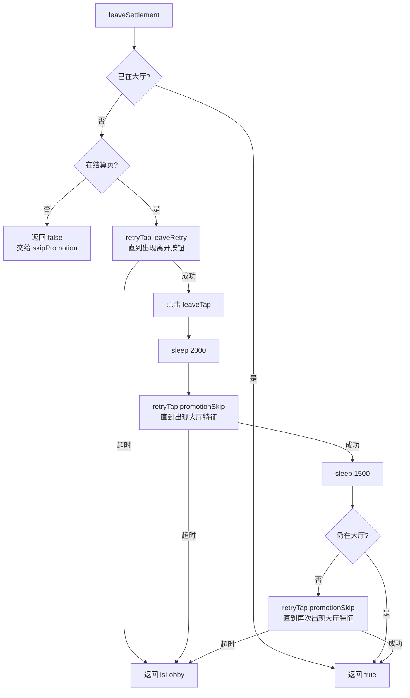

# 王国竞技场模块流程图（状态机版）

> 路径：`帅斌饼干/脚本/game/常规_王国竞技场/`
> 任务文件：`帅斌饼干/脚本/game/常规_王国竞技场/竞技场_任务.lua`
> 状态机：`core.state-machine`

---

## 1. 状态机全景

---

## 2. 状态转换表

| 当前状态 | 触发条件 | 下一状态 | 说明 |
|---|---|---|---|
| `checkEnable` | `enabled == false` 或达 `maxBattles` | `DONE` | 直接结束 |
| `checkEnable` | 正常启用 | `enter` | 开始导航 |
| `enter` | 进入成功 | `syncStatus` | 同步资源 |
| `enter` | 进入失败 | `false` | 致命错误 |
| `syncStatus` | 同步完成 | `decideAction` | 进入决策 |
| `decideAction` | `promotionFlag == true` | `sweep` | 先右滑重置再扫荡 |
| `decideAction` | `sweepFinished == true` | `freeRefresh` | 统一处理刷新/倒计时 |
| `decideAction` | 门票 <= 0 | `autoBuy` | 尝试买票 |
| `decideAction` | 正常 | `sweep` | 继续扫荡 |
| `sweep` | 找到可战斗对手 | `battle` | 点击开战 |
| `sweep` | 门票不足 | `autoBuy` | 买票 |
| `sweep` | 达到上限 | `decideAction` | 设置 sweepFinished |
| `sweep` | 跳过/过滤后还有位置 | `KEEP` | 继续同状态 |
| `sweep` | 全部跳过/过滤完 | `decideAction` | 设置 sweepFinished |
| `battle` | 战斗完成 | `postBattle` | 战后处理 |
| `battle` | 战斗异常 | `false` | 致命错误 |
| `postBattle` | 判定升段 | `decideAction` | 设置 promotionFlag |
| `postBattle` | 还有位置 | `KEEP` → `sweep` | 继续扫荡 |
| `postBattle` | 全部完成 | `decideAction` | 设置 sweepFinished |
| `autoBuy` | 买票成功 | `sweep` | 重置扫荡位置 |
| `autoBuy` | 未启用/达上限/买票失败 | `leave` | 安全退出 |
| `freeRefresh` | 检测到免费刷新 | `syncStatus` | 点击刷新，开启新一轮 |
| `freeRefresh` | 未检测到免费刷新 | `leave` | 解析倒计时，设置下次进入时间 |
| `leave` | 离开完成 | `DONE` | 任务结束 |

---

## 3. 扫荡状态内部流程（sweep）

---

## 4. 战后处理状态（postBattle）

---

## 5. 自动买票状态（autoBuy）

---

## 6. 免费刷新状态（freeRefresh）

---

## 7. 进入竞技场路由

---

## 8. 单场战斗流程（runBattle）

---

## 9. 离开结算页 + 升段跳过流程

