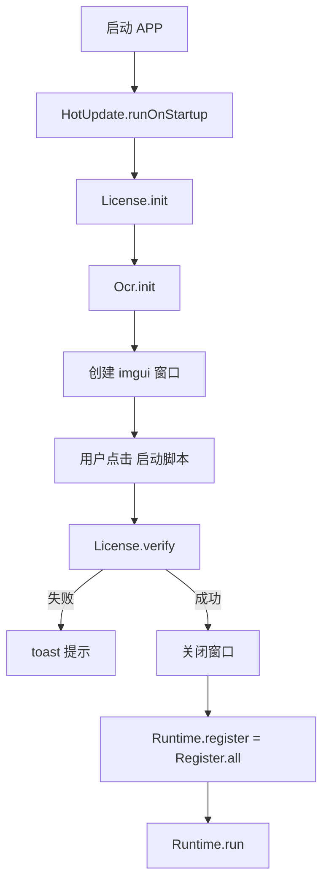
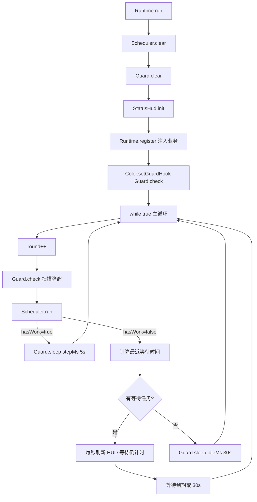
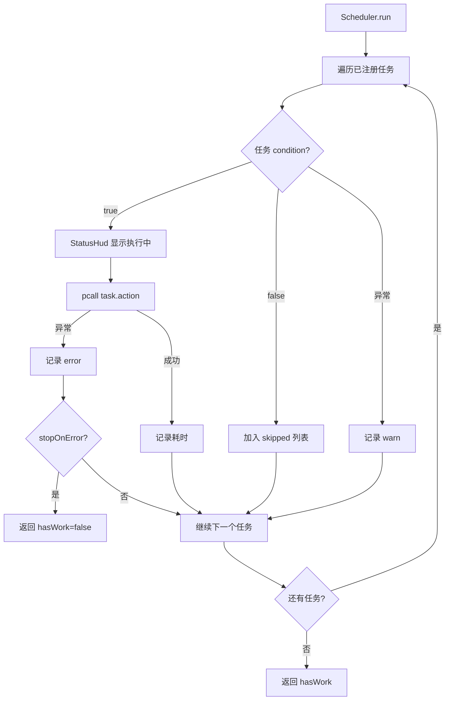
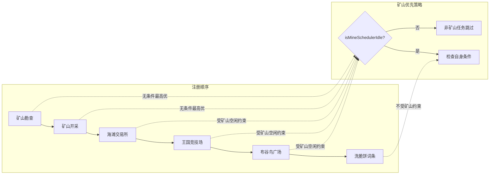
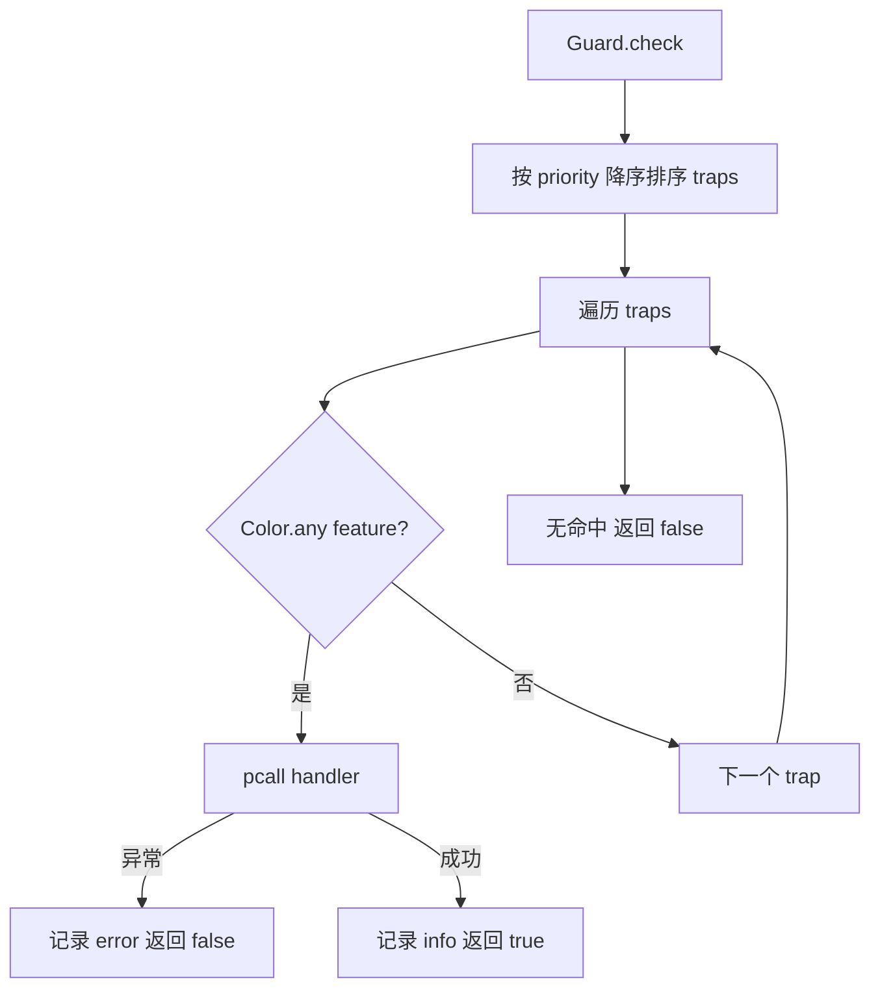
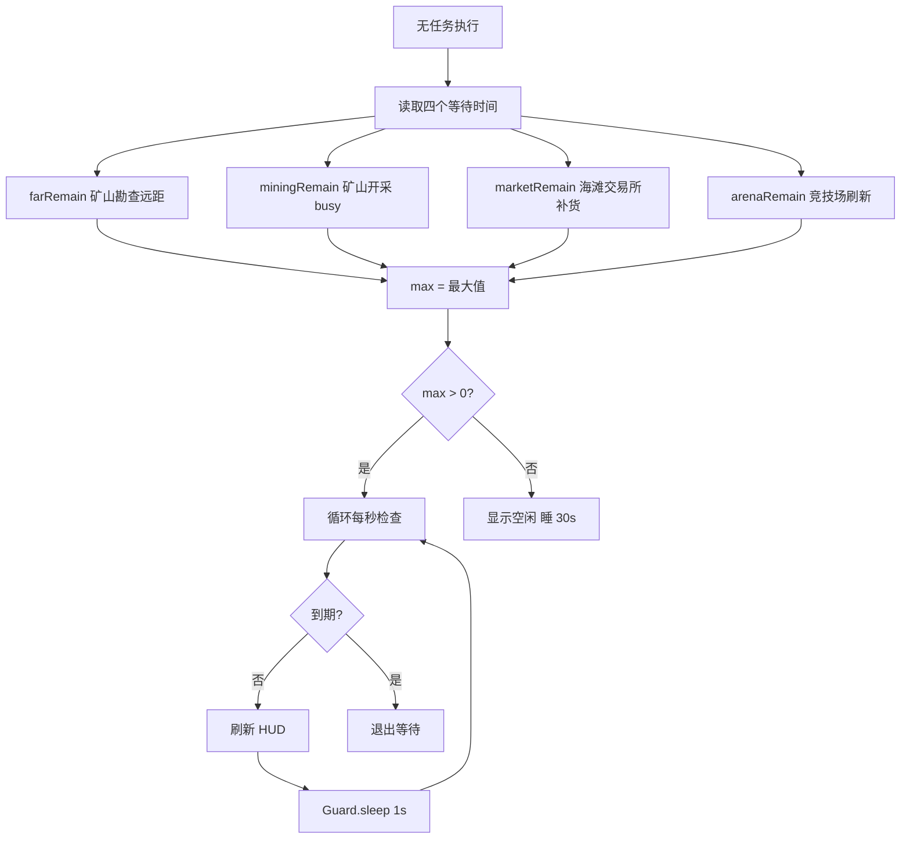
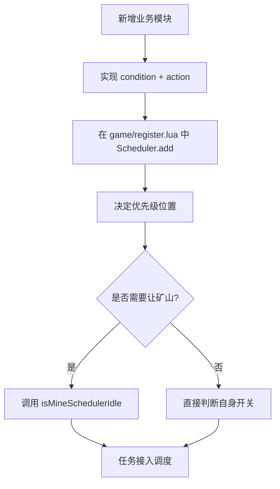

# 项目任务调度流程图

> 核心模块：`core/runtime.lua`、`core/scheduler.lua`、`core/guard.lua`、`game/register.lua`

---

## 1. 启动链路

---

## 2. 运行时主循环

---

## 3. 调度器单轮执行

---

## 4. 任务优先级与条件判断

---

## 5. 守卫（Guard）扫描

---

## 6. 空闲等待策略

---

## 7. 扩展新任务位置

