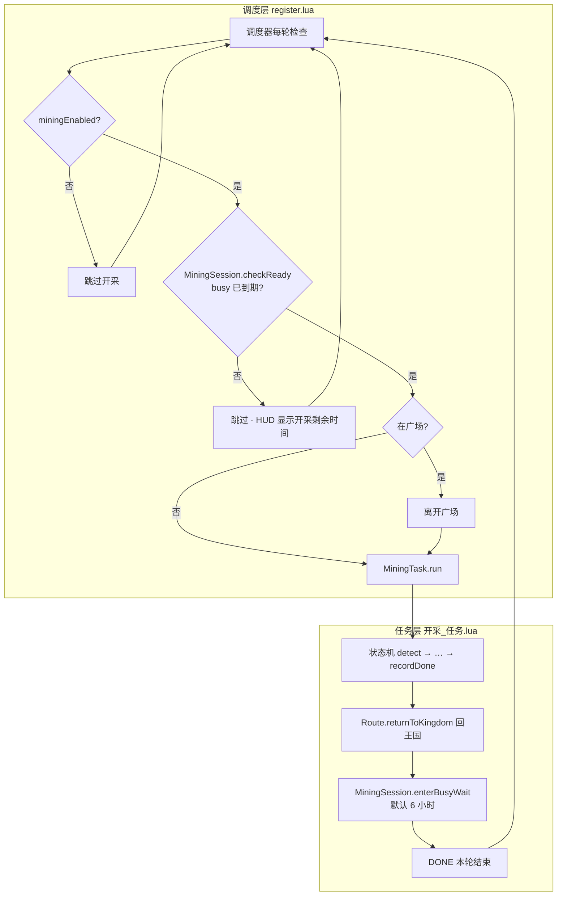
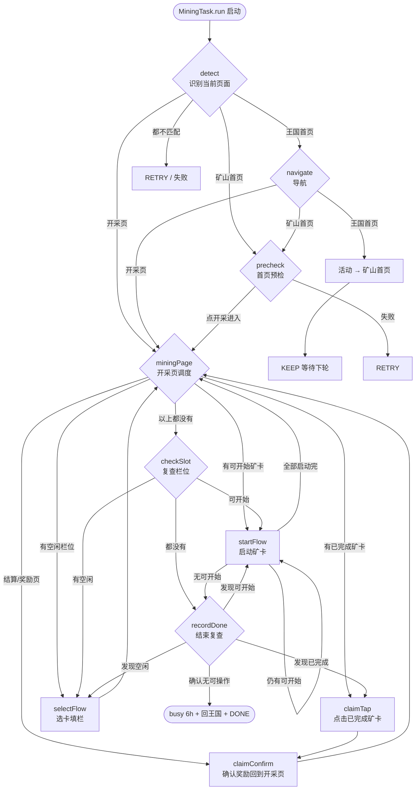
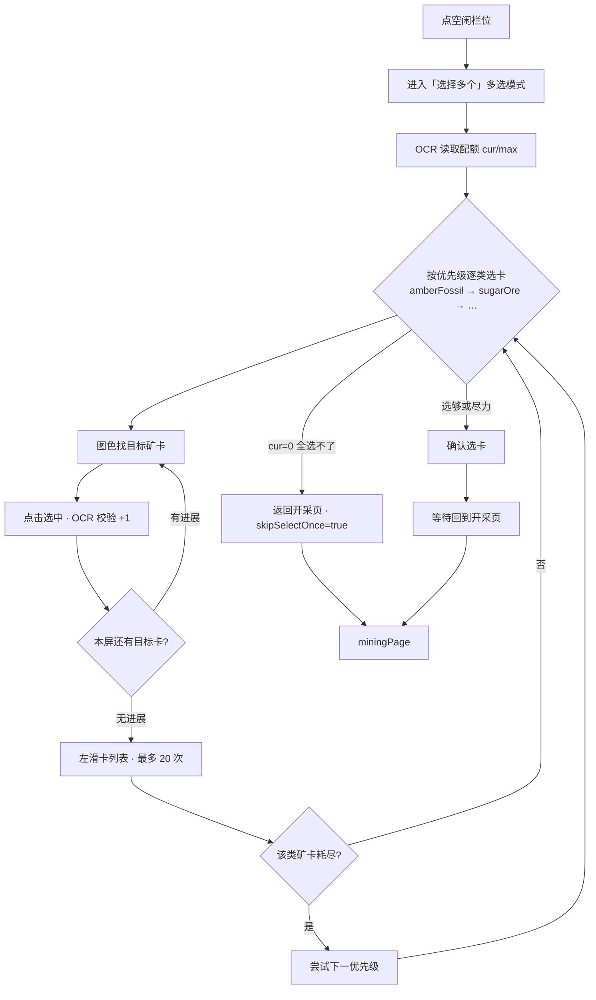
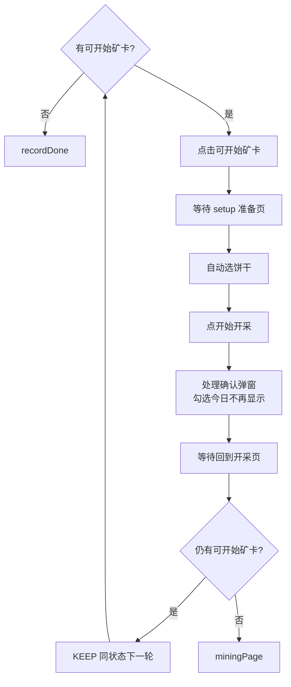
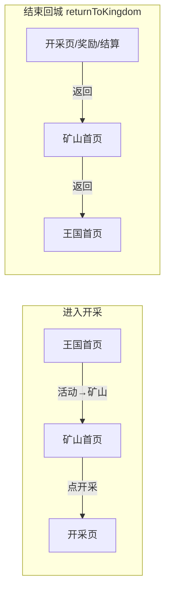

# 矿山开采流程

> 对应代码：`帅斌饼干/脚本/game/常规_未知的地底矿山/模块_矿山开采/`  
> 最后更新：2026-06-15

---

## 一、宏观：从调度到再次执行



**要点：**

- 与勘查任务**独立调度**，互不阻塞
- 本轮结束后写入 `busy` 截止时间（默认 6h），到期前调度器不再拉起
- 空闲时 HUD 可与勘查合并显示：`勘查远距 Xs · 开采 Ys`

---

## 二、状态机总览（核心）



**状态机参数：** `maxRetry=3`，`timeout=1800s`，轮询间隔 `500ms`。

---

## 三、`miningPage` 决策优先级

开采页每次进入按**固定顺序**判断，先匹配先执行：

| 优先级 | 条件 | 下一状态 | 说明 |
|--------|------|----------|------|
| 1 | 结算路径 / 奖励页 | `claimConfirm` | OCR「获得开采奖励」或首页已离开且非开采页 |
| 2 | 有已完成任务 | `claimTap` | 绿色完成标记矿卡 |
| 3 | 有空闲栏位 | `selectFlow` | 除非 `skipSelectOnce`（上轮选卡全失败） |
| 4 | 有可开始矿卡 | `startFlow` | 已选卡、待点「开始」 |
| 5 | 以上都没有 | `checkSlot` | 二次确认后可能结束 |

---

## 四、`selectFlow` 选卡子流程



**选卡优先级来源：** `UserConfig.mine.miningOreCards`（UI 勾选顺序），默认：

1. 琥珀化石（amberFossil）
2. 糖矿石（sugarOre）
3. 紫化石（purpleFossil）
4. 绿化石（emeraldFossil）
5. 面粉石（flourStone）

---

## 五、`startFlow` 启动子流程



---

## 六、导航路径



---

## 七、模块职责

| 模块 | 文件 | 职责 |
|------|------|------|
| 调度 | `game/register.lua` | 开关检查、busy 等待、离开广场 |
| 任务 | `模块_矿山开采/开采_任务.lua` | 状态机主流程 |
| 页面 | `模块_矿山开采/开采_页面.lua` | 图色 / OCR / 触控 |
| 会话 | `模块_矿山开采/开采_会话.lua` | 6h busy 持久化 |
| 路由 | `矿山_路由.lua` | 王国 ↔ 矿山 ↔ 开采页 |
| 特征 | `矿山_特征库.lua` | 页面特征 + 矿卡图色 |
| 首页 | `矿山首页_页面.lua` | 矿山首页识别与按钮 |

---

## 八、配置项

| 配置项 | 默认值 | 说明 |
|--------|--------|------|
| `miningEnabled` | `false` | 是否开启开采 |
| `miningIntervalSec` | `21600`（6h） | 本轮结束后再次调度间隔 |
| `miningOreCards` | 见上文优先级 | 选卡种类与顺序 |

---

## 九、一次完整运行示例

```
调度到期 → 离开广场（如在广场）
  → detect（王国）→ navigate → precheck
  → miningPage
      ├─ 有空位 → selectFlow（按优先级选满）→ miningPage
      ├─ 有可开始 → startFlow（可能多轮 KEEP）→ miningPage
      ├─ 有已完成 → claimTap → claimConfirm → miningPage（循环领奖）
      └─ 栏位全满且都在跑 → checkSlot → recordDone
  → enterBusyWait(6h) → returnToKingdom → DONE
  → 调度器等待 6 小时后再次执行
```

---

## 十、相关文件路径

```
项目_帅斌饼干助手/
└── 帅斌饼干/脚本/game/常规_未知的地底矿山/
    ├── 矿山_路由.lua
    ├── 矿山_特征库.lua
    ├── 矿山首页_页面.lua
    └── 模块_矿山开采/
        ├── 开采_任务.lua
        ├── 开采_页面.lua
        └── 开采_会话.lua
```
