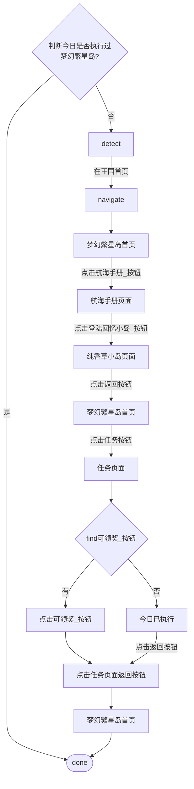
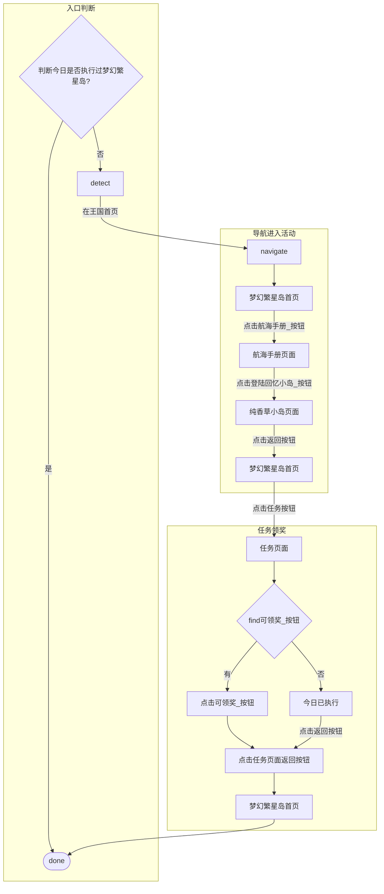

# 梦幻繁星岛模块流程图

> 路径：`帅斌饼干/脚本/game/常规_梦幻繁星岛/`  
> 坐标库：`繁星岛_坐标库.lua`  
> 来源：业务流程设计稿（draw.io）

---

## 1. 任务总览

---

## 2. 分阶段流程

---

## 3. 页面与操作对照表

| 步骤 | 页面/状态 | 操作 | 坐标库分区 |
|---|---|---|---|
| 入口 | — | 判断今日是否已执行 | 会话持久化 |
| 1 | detect | 识别当前页面 | — |
| 2 | navigate | 在王国首页导航至活动 | `通用_王国` |
| 3 | 梦幻繁星岛首页 | 点击航海手册 | `home.航海手册_按钮` |
| 4 | 航海手册页面 | 点击登陆回忆小岛 | `航海手册.登陆回忆小岛_按钮` |
| 5 | 纯香草小岛页面 | 点击返回 | `纯香草小岛.backBtn` |
| 6 | 梦幻繁星岛首页 | 点击任务 | `home.taskBtn` |
| 7 | 任务页面 | find 可领奖按钮 | `任务.可领奖_按钮` |
| 8a | 任务页面 | 有可领奖 → 点击领奖 | `任务.可领奖_按钮` |
| 8b | 任务页面 | 无可领奖 → 标记今日已执行 | 会话持久化 |
| 9 | 任务页面 | 点击返回 | `任务.backBtn` |
| 10 | 梦幻繁星岛首页 | 流程结束 | — |

---

## 4. 页面识别特征

| 页面 | 坐标库 key | 用途 |
|---|---|---|
| 梦幻繁星岛首页 | `home.feature` | detect / navigate 目标页 |
| 航海手册页面 | `航海手册.feature` | 进入纯香草小岛前确认 |
| 纯香草小岛页面 | `纯香草小岛.feature` | 每日签到/回忆入口 |
| 任务页面 | `任务.feature` | 查找可领奖按钮 |

---

## 5. 关键分支说明

1. **每日一次**：任务入口与任务页均会判断「今日是否已执行」，避免重复跑图。
2. **领奖逻辑**：在任务页 `find` 可领奖按钮；找到则点击并返回，未找到则写入「今日已执行」后返回。
3. **导航路径**：王国首页 → 梦幻繁星岛首页 → 航海手册 → 纯香草小岛 → 返回首页 → 任务页 → 结束。

---

## 6. 相关文件

- 模块说明：`项目说明文档/梦幻繁星岛模块说明文档.md`
- 坐标配置：`帅斌饼干/脚本/game/常规_梦幻繁星岛/繁星岛_坐标库.lua`
- 王国入口按钮：`帅斌饼干/脚本/game/通用_王国/特征库.lua`（`梦幻繁星岛_按钮`）
- 调度注册：`帅斌饼干/脚本/game/register.lua`（待接入）
