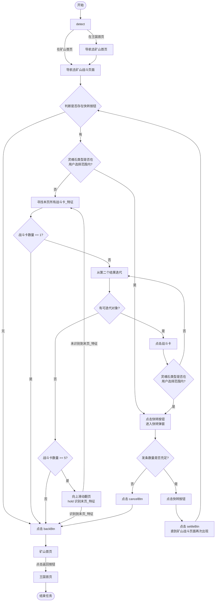
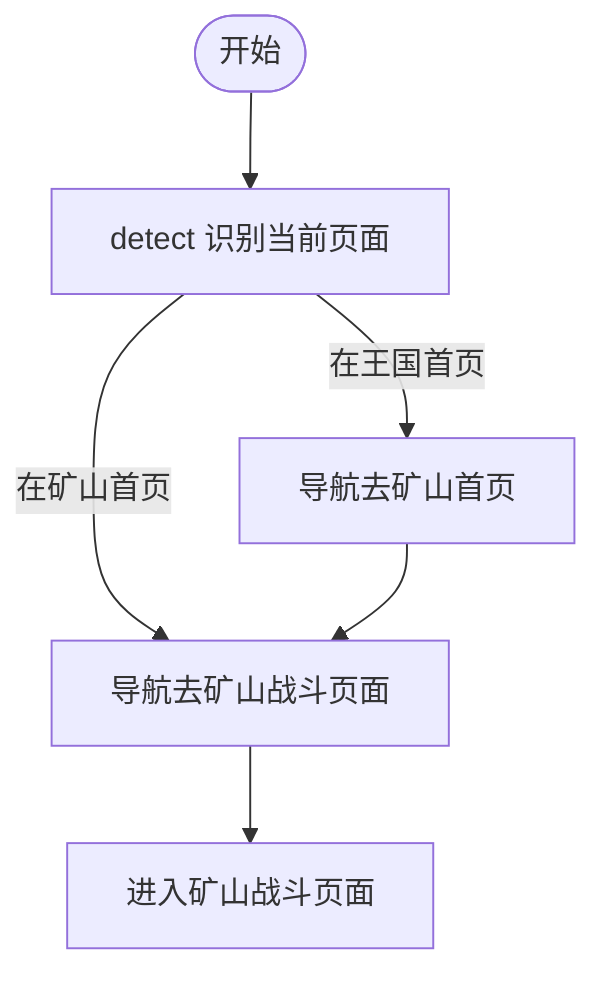
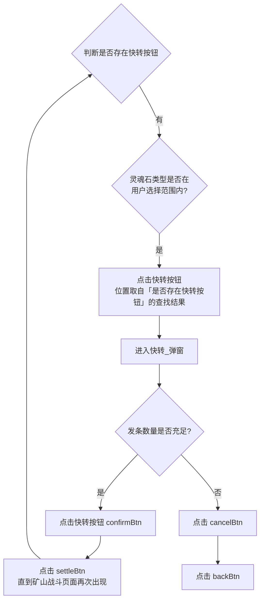
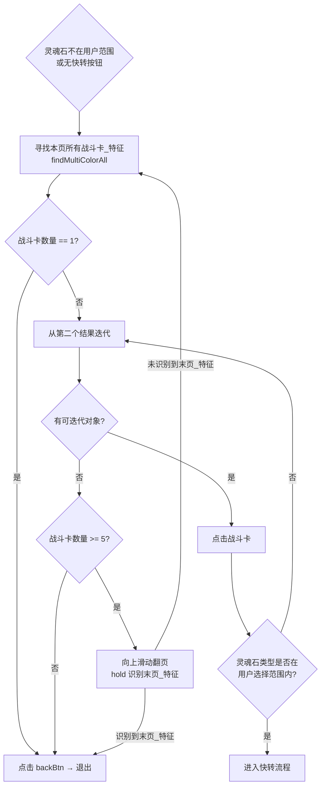
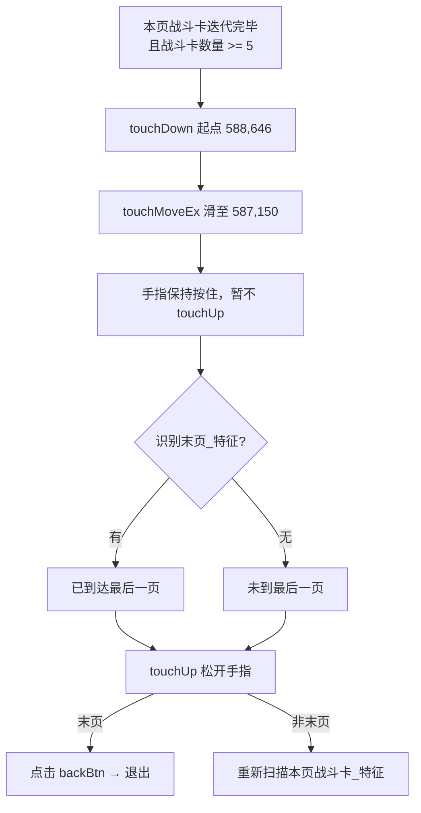

# 矿山战斗流程

> 对应代码：`帅斌饼干/脚本/game/常规_未知的地底矿山/模块_矿山战斗/`  
> 特征配置：`帅斌饼干/脚本/game/常规_未知的地底矿山/矿山_特征库.lua`（`battle` 分区）  
> 来源：业务流程设计稿（draw.io）  
> 最后更新：2026-06-23

---

## 一、任务总览



**要点：**

- 优先处理当前页已可见的**快转**机会（灵魂石在用户选择范围内）
- 无快转时扫描**战斗卡**，从第二个结果起逐张点击并校验灵魂石
- 快转成功后通过 `settleBtn` 回到战斗页，**循环**再次检测快转按钮
- 退出时依次返回：战斗页 → 矿山首页 → 王国首页

---

## 二、导航阶段



---

## 三、快转分支



**说明：**

- 快转按钮坐标来自 `Color.find` 命中结果，非固定坐标
- 发条数量通过 `快转发条数量_Ocr` 读取（格式 `使用/持有`，如 `1/12,611`）
- 结算页持续点击 `settleBtn`，直到 `battle.feature` 再次出现

---

## 四、战斗卡扫描与迭代



**说明：**

- 使用 `战斗卡_特征` 全页扫描，跳过第一个结果，从第二个起逐张尝试
- 每张战斗卡点击后 OCR/比色识别 `灵魂石识别区域`，与用户勾选的 `灵魂石类型` 比对
- 当前页全部迭代完毕且战斗卡 ≥ 5 张时，执行向上滑动翻页（详见第五节）

---

## 五、翻页判断（hold 识别末页）

本页战斗卡全部迭代完毕且数量 ≥ 5 时，通过**向上滑动 + 按住不松手识别末页**判断是否还有下一页。



**操作步骤：**

| 步骤 | 动作 | 说明 |
|---|---|---|
| 1 | `touchDown(588, 646)` | 在列表区域按下起点 |
| 2 | `touchMoveEx` 滑至 `(587, 150)` | 向上滑动，露出下一页内容 |
| 3 | **不调用 `touchUp`** | 滑动结束后手指仍按住屏幕 |
| 4 | `Color.any(末页_特征)` | 在按住状态下识别是否已到末页 |
| 5 | `touchUp` | 识别完成后松开手指 |
| 6 | 分支 | 有末页特征 → 退出；无 → 重新 `findMultiColorAll` 扫描战斗卡 |

**判定规则：**

- **识别到 `末页_特征`**：说明当前已在最后一页，本页无可继续操作的目标，松手后走退出链路
- **未识别到 `末页_特征`**：说明还能继续翻页，松手后回到「寻找本页所有战斗卡_特征」，从新页第一张起重新迭代

**实现提示：**

- 滑动坐标配置在 `battle.翻页滑动`（`x1=588, y1=646, x2=587, y2=150`）
- 不可使用普通 `Touch.swipeEx` 一次性完成（其内部会自动 `touchUp`）；需拆分为 `touchDown` → `touchMoveEx` → 比色 → `touchUp`
- `末页_特征` 比色区域见 `battle.末页_特征`

---

## 六、退出链路


---

## 七、关键分支对照表

| 节点 | 分支 | 行为 |
|---|---|---|
| detect | 在王国首页 / 在矿山首页 | 分别导航至矿山首页、战斗页 |
| 是否存在快转按钮 | 有 / 无 | 有则校验灵魂石；无则直接退出 |
| 灵魂石类型 | 是 / 否 | 是则快转；否则扫描战斗卡 |
| 战斗卡数量 | == 1 / >= 5 / < 5 | 仅 1 张或 < 5 且无可操作项时退出；>= 5 尝试翻页 |
| 迭代战斗卡 | 灵魂石匹配 / 不匹配 | 匹配则进入快转；不匹配继续下一张 |
| 发条数量 | 充足 / 不足 | 充足则快转并结算后回到战斗页循环；不足则取消并退出 |
| 翻页（hold 识别） | 无末页_特征 / 有末页_特征 | 无则松手后重新扫描战斗卡；有则松手后退出 |

---

## 八、特征库对照（battle 分区）

| 配置项 | 用途 |
|---|---|
| `feature` | 矿山战斗页识别 |
| `backBtn` | 战斗页返回按钮 |
| `快转_按钮` | 战斗页快转按钮 find |
| `快转_弹窗.feature` | 快转弹窗识别 |
| `快转_弹窗.confirmBtn` | 弹窗内确认快转 |
| `快转_弹窗.cancelBtn` | 弹窗内取消 |
| `快转_弹窗.快转发条数量_Ocr` | 发条使用/持有数量 OCR |
| `settleBtn` | 快转结算页点击完成 |
| `灵魂石识别区域` | 灵魂石 OCR/比色区域 |
| `灵魂石类型` | 史诗/传奇/上古/野兽各子类型比色特征 |
| `战斗卡_特征` | 全页战斗卡 findMultiColorAll |
| `翻页滑动` | 向上翻页起点/终点（588,646 → 587,150） |
| `末页_特征` | 滑动 hold 期间识别是否已到末页 |

---

## 九、核心循环与结束条件

**主循环：**

```
战斗页 → 检测快转 → 快转成功 → settleBtn 结算 → 回到战斗页 → 再次检测快转
```

**结束条件（任一满足即退出）：**

1. 战斗页无快转按钮
2. 灵魂石不在用户选择范围，且当前页无可操作战斗卡
3. 战斗卡数量 < 5 且本页已迭代完毕
4. 翻页 hold 期间识别到 `末页_特征`（已到最后一页）且本页已迭代完毕
5. 发条数量不足（取消快转弹窗后退出）

---

## 十、相关文件

- 任务实现（待开发）：`帅斌饼干/脚本/game/常规_未知的地底矿山/模块_矿山战斗/战斗_任务.lua`
- 特征配置：`帅斌饼干/脚本/game/常规_未知的地底矿山/矿山_特征库.lua`
- 矿山开采流程：`项目说明文档/矿山开采流程.md`
- 调度注册：`帅斌饼干/脚本/game/register.lua`（待接入）
