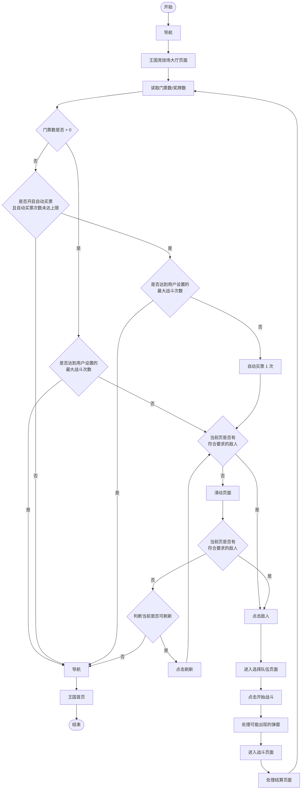
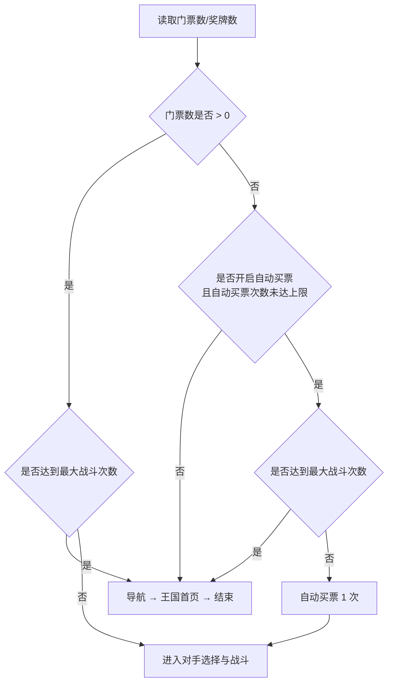
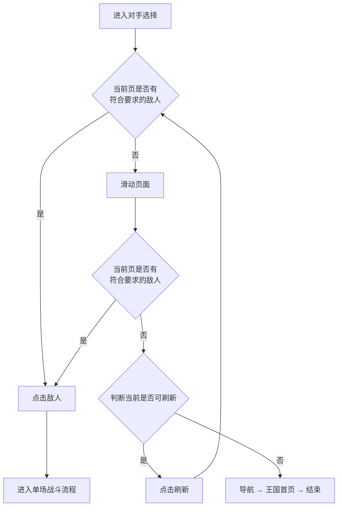
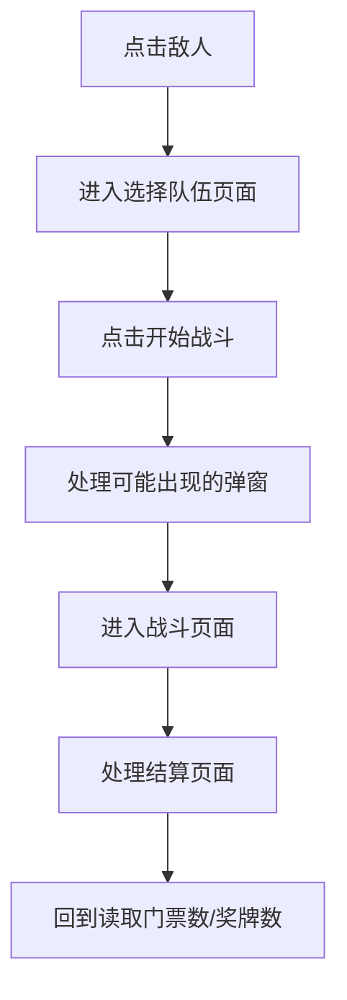
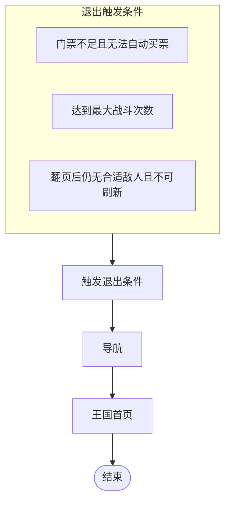

# 王国竞技场流程图

> 对应代码：`帅斌饼干/脚本/game/常规_王国竞技场/`  
> 来源：业务流程设计稿（draw.io / `未命名表单.xsd`）  
> 最后更新：2026-06-24

---

## 一、任务总览

**要点：**

- 进入大厅后先同步**门票数 / 奖牌数**，再决定是否继续战斗
- 有门票且未达战斗上限时，**直接进入对手选择**，不触发自动买票
- 门票为 0 时，仅在「已开启自动买票且未达买票上限」时尝试买票；否则直接退出
- 达到用户设置的**最大战斗次数**后，导航回王国首页结束
- 对手选择：当前页找敌人 → 找不到则滑动翻页再找 → 仍找不到则尝试刷新 → 不可刷新则退出
- 单场战斗结束后回到「读取门票数/奖牌数」，形成循环

---

## 二、进入与前置检查

### 2.1 门票与自动买票

| 条件 | 结果 |
|---|---|
| 门票 > 0，已达战斗上限 | 退出 |
| 门票 > 0，未达战斗上限 | 直接进入对手选择 |
| 门票 = 0，未开启自动买票或已达买票上限 | 退出 |
| 门票 = 0，可自动买票，且未达战斗上限 | 买票 1 次 → 进入对手选择 |

---

## 三、对手选择与刷新

**「符合要求的敌人」** 由用户配置决定（如奖杯差、战力、是否已战等），具体过滤规则见实现代码与说明文档。

---

## 四、单场战斗

弹窗处理包括但不限于：

- 「部署更多饼干」确认
- 「未装载配料」确认

---

## 五、退出路径汇总

---

## 六、节点对照表

| 设计稿节点 | 说明 | 代码对应（参考） |
|---|---|---|
| 导航 | 从当前位置进入竞技场 | `竞技场_路由.enter()` |
| 王国竞技场大厅页面 | 确认到达大厅 | `ArenaPage.isLobby()` / `waitLobby()` |
| 读取门票数/奖牌数 | OCR 同步资源 | `ArenaPage.readMedalAndTicket()` |
| 门票数是否 > 0 | 是否有足够门票继续 | `decideAction` / `sweep` 中门票判断 |
| 是否开启自动买票… | 买票开关与次数上限 | `config.arena.autoBuyCount` + `Session.buyCount` |
| 是否达到最大战斗次数 | 用户战斗上限 | `config.arena.maxBattles` + `Session.totalBattles()` |
| 自动买票 1 次 | 购买一张门票 | `ArenaPage.buyTicket()` |
| 当前页是否有符合要求的敌人 | 对手过滤与匹配 | `readOpponentInfo()` + 奖杯差过滤 |
| 滑动页面 | 对手列表翻页 | `swipePageLeft()` |
| 判断当前是否可刷新 | 检测免费刷新 | `isFreeRefresh()` |
| 点击刷新 | 触发列表刷新 | `tapFreeRefresh()` |
| 点击敌人 | 选中对手位 | 点击对手坐标 |
| 进入选择队伍页面 | 等待队伍选择 UI | `runBattle()` 首步 |
| 点击开始战斗 | 发起对战 | `runBattle()` |
| 处理可能出现的弹窗 | 部署/配料等弹窗 | `dialog` 特征处理 |
| 进入战斗页面 | 等待战斗开始 UI | `runBattle()` |
| 处理结算页面 | 读取结果并离开结算 | `leaveSettlement()` |
| 导航 → 王国首页 | 安全退出 | `竞技场_路由.leave()` |

---

## 七、与当前实现的差异（改造参考）

设计稿与现有代码在以下节点存在差异，后续改造时可对照：

| 设计稿 | 当前代码 | 备注 |
|---|---|---|
| 结算后回到「读取门票数」 | 回到 `decideAction` / `sweep` 循环 | 语义等价，状态划分不同 |
| 翻页 + 刷新后无敌人则退出 | 两页固定计划 + `freeRefresh` 状态 | 代码有固定页位与倒计时持久化 |
| 无升段判定分支 | 战斗后有升段右滑重置 | 设计稿未体现升段逻辑 |

详细实现说明见：`项目说明文档/竞技场模块说明文档.md`
