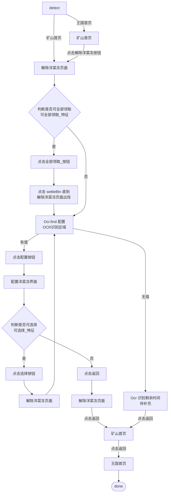
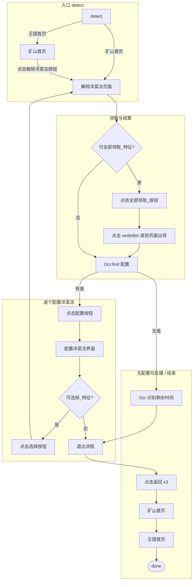

# 解除洋菜冻模块流程图

> 路径：`帅斌饼干/脚本/game/常规_未知的地底矿山/`  
> 特征库：`矿山_特征库.lua` → `解除洋菜冻_特征`  
> 来源：业务流程设计稿（draw.io，`未命名表单.xsd`）

---

## 1. 任务总览

---

## 2. 分阶段流程

---

## 3. 页面与操作对照表

| 步骤 | 页面/状态 | 操作 | 特征库 key |
|---|---|---|---|
| 1 | detect | 识别当前页面 | — |
| 2a | 王国首页 | 导航至矿山首页 | `mineHome` |
| 2b | 矿山首页 | 点击解除洋菜冻 | `mineHome.解除洋菜冻_按钮` |
| 3 | 解除洋菜冻页面 | 判断是否可全部领取 | `可全部领取_特征` |
| 4a | 解除洋菜冻页面 | 是 → 点击全部领取 | `全部领取_按钮` |
| 4b | 解除洋菜冻页面 | 是 → 点击 settle 至页面稳定 | `settleBtn` |
| 5 | 解除洋菜冻页面 | Ocr 查找「配置」按钮坐标 | `OCR识别区域` |
| 6a | 解除洋菜冻页面 | 有坐标 → 点击配置 | — |
| 6b | 解除洋菜冻页面 | 无坐标 → OCR 剩余时间（待补充） | — |
| 7 | 配置洋菜冻界面 | 判断是否可选择 | `配置洋菜冻.可选择_特征` |
| 8a | 配置洋菜冻界面 | 是 → 点击选择 | `配置洋菜冻.选择_按钮` |
| 8b | 配置洋菜冻界面 | 否 → 点击返回 | `配置洋菜冻.backBtn` |
| 9 | 解除洋菜冻页面 | 循环回步骤 5 或连续返回 | `backBtn` |
| 10 | 矿山首页 → 王国首页 | 点击返回直至 done | `mineHome.backBtn` 等 |

---

## 4. 页面识别特征

| 页面 | 特征库 key | 用途 |
|---|---|---|
| 矿山首页 | `mineHome.feature` | detect / 导航目标 |
| 解除洋菜冻页面 | `解除洋菜冻_特征.feature` | 主流程页识别 |
| 可全部领取 | `解除洋菜冻_特征.可全部领取_特征` | 分支：是否批量领取 |
| 配置洋菜冻界面 | `解除洋菜冻_特征.配置洋菜冻.feature` | 单个洋菜冻配置页 |
| 可选择 | `配置洋菜冻.可选择_特征` | 分支：是否还能选下一个 |

---

## 5. 关键分支说明

1. **detect 双入口**：已在矿山首页时直接进入解除洋菜冻页；在王国首页时先经矿山首页再点入口按钮。
2. **全部领取**：命中 `可全部领取_特征` 时先领完并点 `settleBtn`，等待解除洋菜冻页面重新出现后再 OCR 找配置。
3. **配置循环**：OCR 找到「配置」→ 进入配置页 → 可选则点选择 → 回到解除洋菜冻页 → 继续找下一个配置按钮。
4. **无配置可点**：OCR 找不到配置坐标时，识别剩余时间（待补充）后走返回链结束。
5. **不可选择退出**：配置页不可选时，连续返回：配置页 → 解除洋菜冻页 → 矿山首页 → 王国首页 → done。

---

## 6. 相关文件

- 特征配置：`帅斌饼干/脚本/game/常规_未知的地底矿山/矿山_特征库.lua`（`解除洋菜冻_特征`）
- 矿山开采流程：`项目说明文档/矿山开采流程.md`
- 调度注册：`帅斌饼干/脚本/game/register.lua`（待接入）
